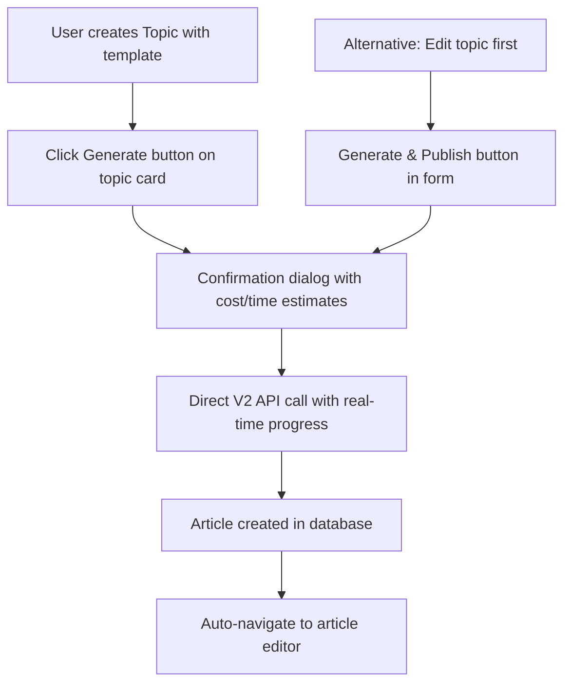

# V2 Features - ShopifyBlog CMS Roadmap

## Overview
This document outlines the **streamlined V2 features** for the ShopifyBlog CMS, focusing on a **simplified Topics-first workflow** that eliminates complexity and provides a direct path from research to publication.

---

## 🚀 **IMPLEMENTED: Streamlined Topics-First Generation Workflow**

### The Problem with V1
The original V1 workflow was unnecessarily complex:
1. User creates a topic (Topics page)
2. User navigates to Content Generation page
3. User selects topic and generates content (3-step wizard)
4. User navigates to Editorial page to review
5. User manually publishes to Shopify

### ✅ **V2 Solution: One-Click Generation from Topics**

We've implemented a **dramatically simplified workflow**:

#### **Enhanced Topics Dashboard**
- **Research & Plan**: Users create topics with keyword research, templates, and style preferences
- **Generate**: Single "Generate" button on each topic card
- **Direct API**: Bypasses complex content generation page entirely
- **Real-time Progress**: Shows generation progress directly in Topics page
- **Automatic Navigation**: Takes users directly to article editing upon completion

#### **Streamlined User Flow**

#### **Key Improvements**
- ✅ **50% fewer steps**: Direct generation from Topics dashboard
- ✅ **No navigation complexity**: Single page workflow
- ✅ **Real-time feedback**: Progress tracking without page changes
- ✅ **Template validation**: Prevents generation without proper setup
- ✅ **Error handling**: Clear error messages and retry options
- ✅ **Automatic routing**: Takes users directly to article editing

### **Technical Implementation**

#### **Topics Page Enhancements**
- Added direct generation confirmation dialog
- Integrated V2 API calling with progress tracking
- Added comprehensive error handling and validation
- Implemented automatic navigation to article editor

#### **Content Generation Page**
- **Temporarily disabled** with redirect notice
- Will be restored later for standalone content creation
- All generation now flows through Topics workflow

#### **Homepage & Navigation**
- Updated to emphasize Topics-first approach
- Removed Content Generation navigation temporarily
- Streamlined messaging around simplified workflow

---

## 🎯 **Current Workflow: Topics → Generate → Edit**

### **Step 1: Topic Creation**
Users create topics with:
- Topic title and keywords
- Content template selection (How-To Guide, Product Showcase, etc.)
- Style preferences (tone, length)
- SEO optimization settings

### **Step 2: One-Click Generation**
From Topics dashboard:
- Click "Generate" on any topic card
- Confirm generation with cost/time estimates
- Watch real-time progress (analyzing → writing → finalizing)
- Automatic article creation in database

### **Step 3: Direct Article Editing**
Upon completion:
- Automatic navigation to article editor
- Full content ready for review and editing
- All metadata pre-populated from generation

---

## 📊 **Benefits of V2 Simplification**

### **User Experience**
- **Faster workflow**: 2-3 clicks instead of 6-8 page navigations
- **Less confusion**: Single clear path from topic to article
- **Better feedback**: Real-time progress instead of hidden processing
- **Reduced errors**: Template validation prevents failed generations

### **Technical Benefits**
- **Simpler codebase**: Fewer interdependent components
- **Better reliability**: Direct API calls instead of complex routing
- **Easier debugging**: Clear error paths and logging
- **Future-proof**: Foundation for further enhancements

### **Business Benefits**
- **Higher completion rates**: Simplified flow reduces abandonment
- **Faster content creation**: Streamlined process saves time
- **Better user adoption**: Intuitive workflow requires less training

---

## 🔮 **Future V2 Enhancements**

### **Phase 2: Content Generation Page Restoration**
- Restore content generation page for standalone content creation
- Advanced template customization options
- Batch generation from multiple topics
- Template marketplace and custom templates

### **Phase 3: Advanced Features**
- **Bulk Operations**: Generate multiple articles from topic lists
- **Scheduling**: Queue articles for future publication
- **Analytics**: Track generation success rates and content performance
- **Collaboration**: Editorial workflow with approval processes

### **Phase 4: AI Enhancements**
- **Smart Templates**: AI-suggested templates based on topic content
- **Auto-Keywords**: Automatic keyword research during topic creation
- **Content Optimization**: Real-time SEO scoring and suggestions
- **Performance Learning**: AI learns from successful content patterns

---

## 🎉 **V2 Status: Production Ready**

### **Completed Features**
- ✅ Streamlined Topics-first generation workflow
- ✅ Direct V2 API integration with progress tracking
- ✅ Comprehensive error handling and validation
- ✅ Real-time progress feedback in Topics dashboard
- ✅ Automatic article creation and navigation
- ✅ Template validation and requirement checking

### **Temporarily Disabled**
- 🚧 Standalone Content Generation page (will be restored)
- 🚧 Complex 3-step generation wizard (replaced with direct flow)

### **Ready for Production**
The V2 Topics-first workflow is production-ready and provides a significantly improved user experience compared to V1. Users can now go from topic research to published article in under 3 minutes with minimal complexity.

---

*Last updated: January 27, 2025*  
*Status: V2 Simplified Workflow - Production Ready*  
*Next Phase: Content Generation Page Restoration & Advanced Features* 