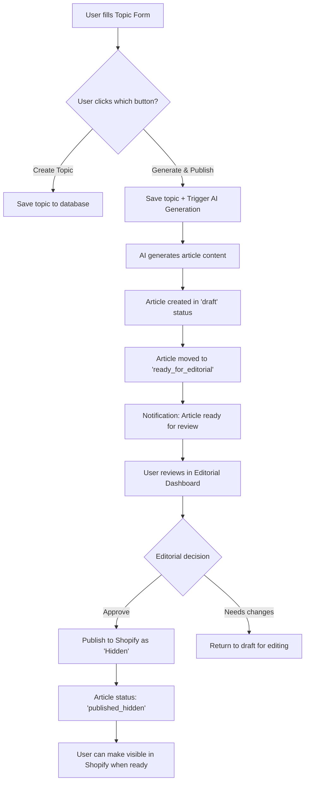

# V2 Features - ShopifyBlog CMS Roadmap

## Overview
This document outlines planned features and improvements for V2 of the ShopifyBlog CMS, focusing on streamlined content creation workflows and enhanced automation.

---

## 🚀 Priority Feature: Integrated Topic-to-Article Generation Workflow

### Current State (V1)
The current workflow requires multiple steps across different pages:
1. User creates a topic (Topics page)
2. User navigates to Content Generation page
3. User selects topic and generates content
4. User navigates to Editorial page to review
5. User manually publishes to Shopify

### Proposed V2 Workflow: One-Click Content Pipeline

#### **Enhanced Topic Creation Interface**

**Page**: `/topics` - Topic Creation Form

**New UI Elements**:
- **Create Topic Button** (existing) - Saves topic for later use
- **🆕 Generate & Publish Button** (new) - Triggers automated content pipeline

#### **Detailed User Flow**



#### **Step-by-Step Flow Description**

**1. Enhanced Topic Creation**
- User fills out topic form with:
  - Topic title and keywords
  - Content template selection
  - Style preferences
  - Industry and market segment
- Two action buttons available:
  - **"Create Topic"** - Traditional workflow (save for later)
  - **"Generate & Publish"** - New automated pipeline

**2. AI Generation Pipeline (Auto-triggered)**
When user clicks "Generate & Publish":
- Topic is saved to database
- AI content generation is immediately triggered
- Article is generated using:
  - Selected content template
  - Specified style preferences
  - Target keywords and industry context
- Generated article automatically gets:
  - Status: `ready_for_editorial`
  - Source topic ID linked
  - Auto-generated meta description
  - SEO optimization applied

**3. Editorial Review Stage**
- Article appears in Editorial Dashboard automatically
- Editor reviews generated content
- Options available:
  - **Approve for Shopify** - Proceed to publication
  - **Request changes** - Send back to draft mode
  - **Edit directly** - Make inline modifications

**4. Automated Shopify Publication**
Upon editorial approval:
- Article is automatically published to Shopify
- **Published in "Hidden" mode** (not visible to customers)
- Shopify article ID is recorded in database
- Article status becomes: `published_hidden`

**5. Final Visibility Control**
- User can manually make article visible in Shopify admin when ready
- Or implement scheduled visibility (future feature)

---

## 📊 User Experience Improvements

### **Benefits of New Workflow**
- **Reduced clicks**: From 15+ steps to 5 steps
- **Faster content creation**: Immediate generation upon topic creation
- **Quality control**: Editorial review before publication
- **Safe publication**: Hidden mode prevents accidental exposure
- **Streamlined process**: Single-page topic creation to publication

### **UI/UX Enhancements Needed**

#### **Topic Form Enhancements**
- Add progress indicator for generation process
- Show real-time status updates during AI generation
- Display estimated completion time
- Add option to "Generate later" vs "Generate now"

#### **Editorial Dashboard Improvements**
- Add filter for "Ready for Review" articles
- Implement bulk approval actions
- Add preview mode for generated content
- Include generation metadata (AI model used, generation time, etc.)

#### **Status Tracking**
New article statuses to implement:
- `generating` - AI is creating content
- `generation_failed` - AI generation encountered error
- `ready_for_editorial` - Generated content awaiting review
- `published_hidden` - Live on Shopify but not visible
- `published_visible` - Live and visible to customers

---

## 🔧 Technical Implementation Requirements

### **API Enhancements**
- **New endpoint**: `POST /api/topics/generate-and-publish`
- **Enhanced topic creation**: Integrate with AI generation service
- **Webhook support**: For generation status updates
- **Error handling**: Graceful fallback if AI generation fails

### **Database Schema Updates**
```sql
-- Add new article statuses
ALTER TYPE article_status ADD VALUE 'generating';
ALTER TYPE article_status ADD VALUE 'generation_failed';
ALTER TYPE article_status ADD VALUE 'ready_for_editorial';
ALTER TYPE article_status ADD VALUE 'published_hidden';
ALTER TYPE article_status ADD VALUE 'published_visible';

-- Add generation metadata
ALTER TABLE articles ADD COLUMN generation_started_at TIMESTAMP;
ALTER TABLE articles ADD COLUMN generation_completed_at TIMESTAMP;
ALTER TABLE articles ADD COLUMN ai_model_used VARCHAR(100);
ALTER TABLE articles ADD COLUMN generation_prompt_version VARCHAR(50);
```

### **Component Updates Needed**
- `topic-form-enhanced.tsx` - Add Generate & Publish button
- `article-review-dashboard.tsx` - Handle new statuses
- `content-generator.tsx` - Support direct topic integration
- New component: `generation-status-tracker.tsx`

---

## 🎯 Future Enhancements (V2.1+)

### **Advanced Automation**
- **Scheduled publishing**: Auto-make articles visible at specified times
- **A/B testing**: Generate multiple variations for testing
- **Bulk operations**: Generate articles for multiple topics simultaneously
- **Smart scheduling**: AI-recommended optimal publish times

### **Quality Assurance**
- **Content scoring**: AI-powered quality assessment
- **Plagiarism checking**: Integration with content verification services
- **SEO scoring**: Real-time SEO optimization suggestions
- **Brand voice consistency**: Ensure content matches brand guidelines

### **Analytics Integration**
- **Performance tracking**: Monitor generated content effectiveness
- **Conversion metrics**: Track article-to-sale conversions
- **User engagement**: Monitor reading time and interaction rates
- **ROI analysis**: Calculate content generation ROI

---

## 📋 Implementation Timeline

### **Phase 1: Core Workflow (4-6 weeks)**
- [ ] Enhanced topic form with Generate button
- [ ] Integrated AI generation pipeline
- [ ] Editorial review system updates
- [ ] Automated Shopify hidden publication

### **Phase 2: UX Polish (2-3 weeks)**
- [ ] Status tracking and progress indicators
- [ ] Error handling and user feedback
- [ ] Performance optimizations
- [ ] Mobile responsiveness

### **Phase 3: Advanced Features (3-4 weeks)**
- [ ] Bulk operations
- [ ] Scheduled visibility
- [ ] Analytics dashboard
- [ ] Quality scoring system

---

## 🔍 Success Metrics

### **Efficiency Metrics**
- **Time to publish**: Target 80% reduction (from hours to minutes)
- **User satisfaction**: >90% approval rating for new workflow
- **Error rate**: <5% generation failure rate
- **Adoption rate**: >75% of users use Generate & Publish vs traditional flow

### **Content Quality Metrics**
- **Editorial approval rate**: >85% of generated articles approved
- **SEO performance**: Maintain or improve current SEO scores
- **User engagement**: Match or exceed manually created content metrics
- **Conversion rates**: Track sales attribution to generated content

---

## 💡 Additional Considerations

### **Error Handling Scenarios**
- AI service downtime or failures
- Shopify API rate limiting
- Network connectivity issues
- User session timeouts during generation

### **User Permissions**
- Role-based access to Generate & Publish feature
- Editorial review requirements based on user role
- Approval workflows for sensitive content categories

### **Content Guidelines**
- Template compliance checking
- Brand voice validation
- Fact-checking integration possibilities
- Legal/compliance review workflows

---

*Last updated: January 27, 2025*
*Next review: February 15, 2025* 